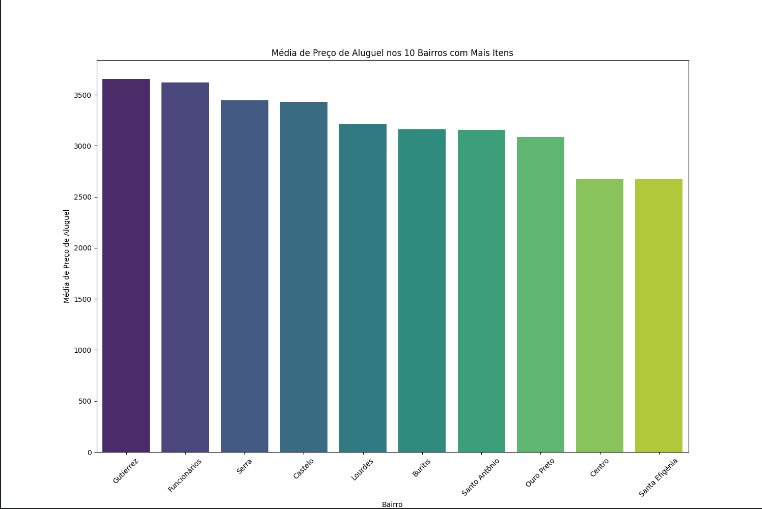
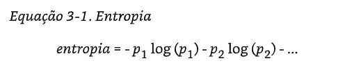
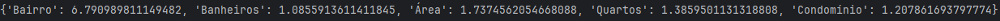

# PrecosQuintoAndar
Comparando algoritmos de regressão utilizando base extraída do Quinto Andar para prever preços de alugueis da cidade de Belo Horizonte.

## Importando os pacote

Os pacotes utilziados foram:

```
import pandas as pd
import openpyxl
import matplotlib.pyplot as plt
import numpy as np
import math
from collections import Counter
from sklearn.ensemble import RandomForestClassifier
from sklearn.model_selection import cross_val_score
from sklearn.model_selection import KFold, cross_val_score
from sklearn.ensemble import RandomForestRegressor
from sklearn.model_selection import train_test_split
from sklearn.metrics import mean_squared_error
from sklearn.linear_model import LinearRegression
from sklearn.model_selection import cross_val_predict
from sklearn.neighbors import KNeighborsRegressor
import seaborn as sns

```


## Análise exploratória

Através de uma análise manual das colunas do dataset extraído da [Apify](https://apify.com/) foi possível correlacionar com o [Método de precificação de aluguel do Quinto Andar](https://mkt.quintoandar.com.br/quanto-cobrar-de-aluguel/) e encontrar diretamente as colunas de maior interesse:

```
bairro = ["houseInfo/address/neighborhood"]
banheiros = ["houseInfo/bathrooms"]
área = ["houseInfo/area"]
quartos = ["houseInfo/bedrooms"]
condomínio = ["houseInfo/condoPrice"]
aluguel = ["houseInfo/rentPrice"]

```
O dataset inicial continha 997 linhas, mas ele foi tratado retirando as linhas em branco e considerando apenas o município de Belo Horizonte

```
base_quinto_andar.dropna(axis=0, how="all", inplace=True)
base_quinto_andar.dropna(axis=1, how="all", inplace=True)

base_quinto_andar_v2 = base_quinto_andar.loc[base_quinto_andar["houseInfo/address/city"] == "Belo Horizonte"]
```

Então, foram calculados os valores máximo, mínimo e médio para averiguar outliers relativos à área:

```
print(max(base_quinto_andar_v2["houseInfo/area"]))
-> 30000
print(min(base_quinto_andar_v2["houseInfo/area"]))
-> 15
print(np.mean(base_quinto_andar_v2["houseInfo/area"]))
-> 130
```
Assim, o dataset foi tratado para retirar este outlier:

```
remover_area = base_quinto_andar_v2[base_quinto_andar_v2["houseInfo/area"] < 30000]
base_quinto_andar_v3 = remover_area
```
Pela visualização gráfica é possível ver a nova distribuição:
```
base_quinto_andar_v3["houseInfo/area"].hist(bins=10)
```


     
Da mesma forma veremos os outliers de preço de aluguel por inspeção visual:
```
base_quinto_andar_v3["houseInfo/rentPrice"].hist(bins=10)
```


  nota-se grande correção entre área e preço de aluguel, mas para fins de simplificação removeremos aqueles cujo aluguel superam 7 mil reais mensais:

```
remover_rent = base_quinto_andar_v2[base_quinto_andar_v2["houseInfo/rentPrice"] < 7000]
remover_rent["houseInfo/rentPrice"].hist(bins=10)
```


O dataset final ficou com 939 linhas. Por fim, mostrarei o preço médio de aluguel para os top 10 bairros em relação a número de empreendimentos:

```
bqa_tratada = remover_rent


media_preco_bairros = bqa_tratada.groupby("houseInfo/address/neighborhood")["houseInfo/rentPrice"].mean()
contagem_bairros = bqa_tratada["houseInfo/address/neighborhood"].value_counts()
top_10_bairros = contagem_bairros.head(10).index
media_preco_top_10_bairros = media_preco_bairros[top_10_bairros]

media_preco_top_10_bairros_sorted = media_preco_top_10_bairros.sort_values(ascending=False)

plt.figure(figsize=(15, 10))
sns.barplot(x=media_preco_top_10_bairros_sorted.index, y=media_preco_top_10_bairros_sorted.values, palette="viridis")
plt.xticks(rotation=45)
plt.xlabel("Bairro")
plt.ylabel("Média de Preço de Aluguel")
plt.title("Média de Preço de Aluguel nos 10 Bairros com Mais Itens")
plt.show()

```



Percebe-se que o número de lugares para alugar na base é diretamente proporcional ao preço do aluguel. O Bairro Gutierrez possui maior número de empreendimentos listados e preço médio de aluguel de R$ 3500,00.

## Seleção de atributo

A seleção de atributo terá como base a entropia e ganho de informação:




onde cada p representa a proporção de uma classe dentro de um atributo sobre o total de itens do atributo:

As equações foram traduzidas em fórmulas:
```
def entropia(col):
    entropia = 0
    col_cte = Counter(col)

    for classe in col.unique():
        prob = col_cte[classe] / len(col)
        entropia -= prob * math.log2(prob)

    return entropia


def ganho_de_informacao(col):
    col_cte = Counter(col)
    entropia_ponderada = 0

    for classe in col.unique():
        prob_label = col_cte[classe] / len(col)
        entropia_ponderada -= prob_label * prob_label * math.log2(prob_label)

    GI = entropia(col) - entropia_ponderada

    return GI
```

Como os algoritmos de ML tem dificuldade em lidar com atributos numéricos foram criados faixas para área e condomínio.

```
bqa_tratada_v2 = bqa_tratada.copy()

limites = [0, 30, 60, 90, 150, 300, 800]
valores_area = ['0-30', '31-60', '61-90', '91 - 150', '151 - 300', 'acima de 300']
bqa_tratada_v2.loc[:, "Faixa Área"] = pd.cut(bqa_tratada["houseInfo/area"], bins=limites, labels=valores_area, include_lowest=True)

limites2 = [0, 300, 600, 1200, 2000, 3312]
valores_condo = ['0-300', '301-600', '601-1200', '1201-2000','Acima de 2000']
bqa_tratada_v2.loc[:, "Faixa condominio"] = pd.cut(bqa_tratada["houseInfo/condoPrice"],bins=limites2, labels=valores_condo, include_lowest=True)


# Calculando os ganhos de informação para as caracteristicas mais relevantes do quinto andar

bairro = bqa_tratada_v2["houseInfo/address/neighborhood"]
banheiros = bqa_tratada_v2["houseInfo/bathrooms"]
area = bqa_tratada_v2["Faixa Área"]
quartos = bqa_tratada_v2["houseInfo/bedrooms"]
condo = bqa_tratada_v2["Faixa condominio"]

```
Por fim, a matriz de ganho de informação foi gerada:

```
GI_matriz = {
    "Bairro": ganho_de_informacao(bairro),
    "Banheiros": ganho_de_informacao(banheiros),
    "Área": ganho_de_informacao(area),
    "Quartos": ganho_de_informacao(quartos),
    "Condomínio": ganho_de_informacao(condo)
}
```


Pelos altos valores, entende-se que todos os atributos analisados possuem potencial de regressão.

## aplicando e comparando modelos

Primeiro utilizou-se o RandomForestRegressor sem validação cruzada:


```
X = atributos_df[["Banheiros", "Área", "Quartos", "Condomínio"]]
X_dummies = pd.get_dummies(X, columns=["Banheiros", "Área", "Quartos", "Condomínio"])
y = atributos_df["Preço aluguel"]

# Modelo RandomForestRegressor

X_train, X_test, y_train, y_test = train_test_split(X_dummies, y, test_size=0.2, random_state=42)

modelo_1 = RandomForestRegressor(n_estimators=100, random_state=42)
modelo_1.fit(X_train, y_train)

y_pred = modelo_1.predict(X_test)

diferencas = y_test - y_pred
diferencas_absolutas = np.abs(diferencas)
diferenca_percentual = 100 * np.abs(y_test - y_pred) / y_test
desvio_padrao = np.std(diferenca_percentual)

resultado = pd.DataFrame({
    'Real': y_test,
    'Previsto': y_pred,
    'Diferença': diferencas,
    'Diferença Absoluta': diferencas_absolutas,
    'Diferença Percentual': diferenca_percentual,
    'Desvio padrão': desvio_padrao
})

# print(resultado)
print("Raiz do Erro Quadrático Médio (RMSE):", np.sqrt(mean_squared_error(y_test, y_pred)))
print("Média da Diferença Percentual:", np.mean(resultado["Diferença Percentual"]))

```
Os resultados foram:
Raiz do Erro Quadrático Médio (RMSE): 857.2194332360518
Média da Diferença Percentual: 26.211969590667447

Em Seguida foi aplicado a Regressão Linear com validação cruzada:

```
X2 = atributos_df[["Banheiros", "Área", "Quartos", "Condomínio"]]
X_dummies2 = pd.get_dummies(X2, columns=["Banheiros", "Área", "Quartos", "Condomínio"])
y2 = atributos_df["Preço aluguel"]

modelo_2 = LinearRegression()
cv = KFold(n_splits=5, shuffle=True, random_state=42)
y_pred2 = cross_val_predict(modelo_2, X_dummies2, y2, cv=cv)

diferencas2 = y2 - y_pred2
diferencas_absolutas2 = np.abs(diferencas2)
diferenca_percentual2 = 100 * np.abs(y2 - y_pred2) / y2
desvio_padrao2 = np.std(diferenca_percentual2)

resultado2 = pd.DataFrame({
    'Real': y2,
    'Previsto': y_pred2,
    'Diferença': diferencas2,
    'Diferença Absoluta': diferencas_absolutas2,
    'Diferença Percentual': diferenca_percentual2
})
```
Os alguns valores presentes em resultado2 estavam completamente fora da realidade, portanto foram removidos para cálculo das métricas:

```
condicao = (resultado2['Previsto'] >= 1) & (resultado2['Previsto'] <= 100000)
resultado_filtrado = resultado2[condicao]

print("Raiz do Erro Quadrático Médio (RMSE) após filtragem:", np.sqrt(mean_squared_error(resultado_filtrado['Real'], resultado_filtrado['Previsto'])))
print("Média da Diferença Percentual após filtragem:", np.mean(resultado_filtrado['Diferença Percentual']))
```
Raiz do Erro Quadrático Médio (RMSE) após filtragem: 924.5668290558418
Média da Diferença Percentual após filtragem: 31.67726106926854

Por fim, foi aplicado o modelo KNNRegressor com validação cruzada:
```
modelo_3 = KNeighborsRegressor(n_neighbors=5)

X3 = atributos_df[["Banheiros", "Área", "Quartos", "Condomínio"]]
X_dummies3 = pd.get_dummies(X3, columns=["Banheiros", "Área", "Quartos", "Condomínio"])
y3 = atributos_df["Preço aluguel"]

cv3 = KFold(n_splits=5, shuffle=True, random_state=42)
y_pred3 = cross_val_predict(modelo_3, X_dummies3, y3, cv=cv3)

diferencas3 = y3 - y_pred3
diferencas_absolutas3 = np.abs(diferencas3)
diferenca_percentual3 = 100 * np.abs(y3 - y_pred3) / y3
desvio_padrao3 = np.std(diferenca_percentual3)

resultado3 = pd.DataFrame({
    'Real': y3,
    'Previsto': y_pred3,
    'Diferença': diferencas3,
    'Diferença Absoluta': diferencas_absolutas3,
    'Diferença Percentual': diferenca_percentual3
})

print("Raiz do Erro Quadrático Médio (RMSE):", np.sqrt(mean_squared_error(y3, y_pred3)))
print("Média da Diferença Percentual:", np.mean(resultado3["Diferença Percentual"]))
```

Raiz do Erro Quadrático Médio (RMSE): 969.921327573861
Média da Diferença Percentual: 31.30664871732234

# Conclusão

Apesar de ambos os algoritmos serem capazes de realizar a regressão com os atributos selecionados, os resultados ainda deram erros muito altos. O mais adequado é o RandomForestRegressor e mesmo assim possui erro percentual de 26%.


